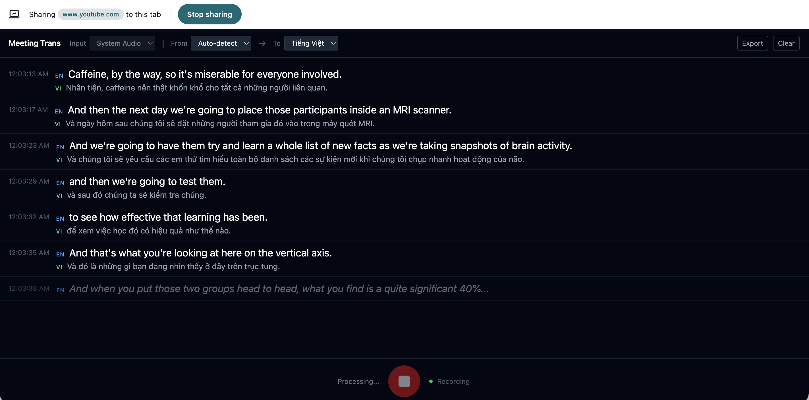

# Meeting Trans

Real-time bilingual speech translator with high-accuracy Vietnamese speech recognition. Speak or play audio in one language, get live bilingual subtitles.

100% offline — your audio never leaves your computer.



## Download

**[Download for macOS (Apple Silicon)](https://github.com/hongluu92/meeting-trans/releases/latest)**

> Requires macOS 13.0+ and an Apple Silicon Mac (M1/M2/M3/M4).

## What It Does

- Real-time Vietnamese speech recognition with up to 97% accuracy
- Speak into your mic — see real-time bilingual subtitles
- Play a video or meeting — capture system audio and get live captions
- Floating caption overlay that stays on top of all windows
- Export transcripts to text files
- Works completely offline — no cloud, no API keys, no subscriptions

## Supported Languages

English, Japanese (日本語), Vietnamese (Tiếng Việt), Korean (한국어)

## Getting Started

### Option 1: Desktop App (Recommended)

1. Download the `.dmg` from [Releases](https://github.com/hongluu92/meeting-trans/releases/latest)
2. Open the DMG, drag **Meeting Trans** to Applications
3. First launch: right-click the app → **Open** → **Open** (macOS unsigned app warning)
4. Start the backend (see below) — the app needs it running
5. Grant **Microphone** and **Screen Recording** permissions when prompted

### Option 2: Web Browser

1. Install prerequisites (see [Development](#development))
2. Run `make dev`
3. Open http://localhost:5173

### Starting the Backend

The backend runs the AI models (speech recognition + translation). Start it before using the app:

```bash
# First time setup
cp .env.example .env
make install

# Start backend
make backend
```

The first run downloads ~1.5GB of AI models. This only happens once.

## How to Use

1. **Select audio source**: Mic (your voice) or System (video/meeting audio)
2. **Choose languages**: Source language (or Auto-detect) → Target language
3. **Press the record button** (or Space) to start
4. **Bilingual subtitles** appear in real-time
5. **Pop out captions**: Click the ↗ button for a floating overlay on top of other apps
6. **Export**: Download your transcript as a text file

### System Audio Capture

To caption videos, meetings, or any audio playing on your computer:

1. Select **System** in the audio source toggle
2. Click record — macOS will ask for **Screen Recording** permission
3. Grant permission in System Settings → Privacy → Screen Recording
4. Play any audio — bilingual captions appear in real-time

## Architecture

```
Desktop App (Tauri + React)     Python Backend (FastAPI)
┌─────────────────────┐        ┌──────────────────────────┐
│ Mic (WebAudio API)  │───WS──▶│ Whisper STT              │
│ System (ScreenCap)  │        │ (mlx-whisper / faster)    │
│                     │◀──WS───│                           │
│ Subtitle Display    │        │ NLLB Translation          │
│ Caption Overlay     │        │ (CTranslate2, offline)    │
└─────────────────────┘        └──────────────────────────┘
```

- **Speech-to-Text**: Whisper small model with VAD-based segmentation
- **Translation**: NLLB 1.3B distilled via CTranslate2
- **Audio**: 16kHz float32 PCM streamed over WebSocket
- **System audio**: ScreenCaptureKit (macOS 13+) via Swift helper

## Configuration

Edit `backend/config.yaml`:

| Setting | Description | Default |
|---------|-------------|---------|
| `whisper.engine` | `mlx` (Apple Silicon) or `faster-whisper` (Intel/CUDA) | `mlx` |
| `whisper.model_size` | `tiny`, `base`, `small`, `medium`, `large-v3` | `small` |
| `vad.silence_duration_ms` | Silence before cutting a segment | `500` |
| `vad.max_segment_s` | Max speech segment length | `25` |
| `translation.beam_size` | Translation quality (higher = better, slower) | `2` |

## Development

### Prerequisites

- Python 3.10+
- Node.js 20+ with pnpm
- Rust (for Tauri desktop app): `curl --proto '=https' --tlsv1.2 -sSf https://sh.rustup.rs | sh`
- 8GB RAM minimum
- Xcode (for system audio Swift helper): `sudo xcode-select -s /Applications/Xcode.app/Contents/Developer`

### Commands

```bash
make install          # Install Python + Node dependencies
make dev              # Start backend + frontend (browser mode)
make backend          # Backend only (port 8000)
make frontend         # Frontend only (port 5173)

# Desktop app
cd frontend
pnpm tauri dev        # Dev mode with hot reload
pnpm tauri build      # Release build (.app + .dmg)

# Compile Swift audio helper (needed for system audio capture)
cd frontend/src-tauri/swift-helper
xcrun swiftc -O -target arm64-apple-macosx13.0 -o capture-audio CaptureAudio.swift \
  -framework ScreenCaptureKit -framework CoreMedia -framework AVFoundation -framework Accelerate
```

## Troubleshooting

| Problem | Solution |
|---------|----------|
| **"Meeting Trans" can't be opened** | Right-click → Open → Open (unsigned app) |
| **Models download slow** | First run downloads ~1.5GB. Be patient. |
| **Mic not working** | Grant Microphone permission in System Settings |
| **System audio not working** | Grant Screen Recording permission in System Settings |
| **High RAM usage** | NLLB needs ~2GB. Close other apps if constrained. |
| **Mac Intel** | Set `whisper.engine: "faster-whisper"` in config.yaml. Remove `mlx-whisper` from requirements.txt. |
| **Backend not connecting** | Make sure `make backend` is running on port 8000 |

## License

MIT
